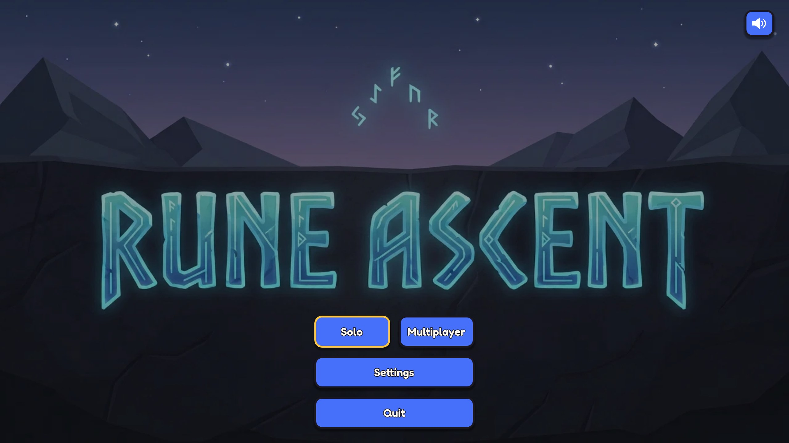
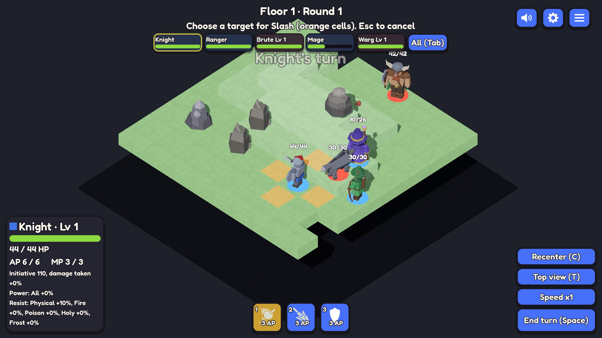
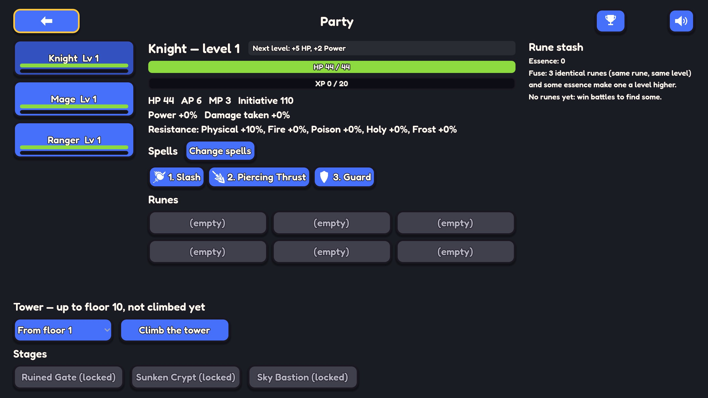
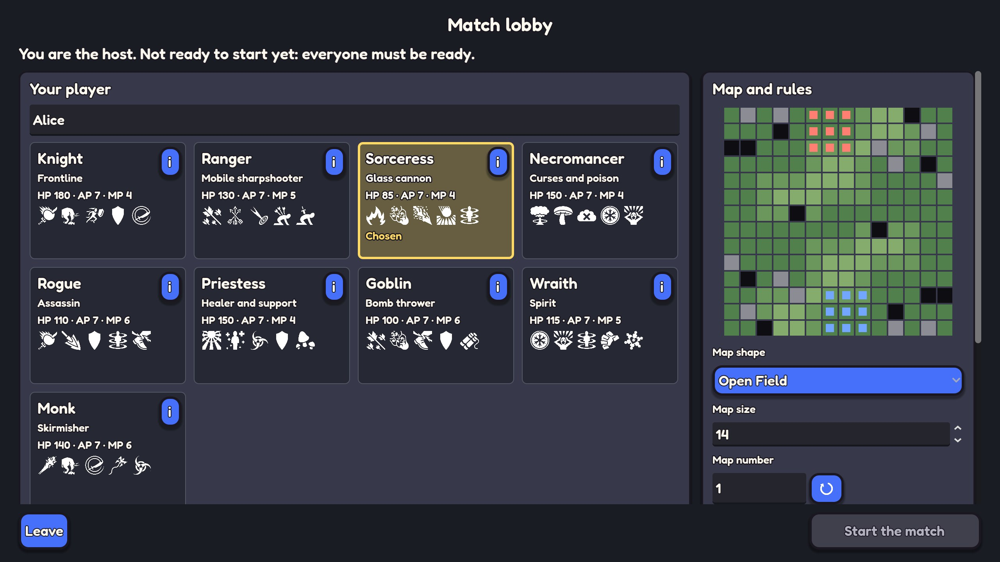
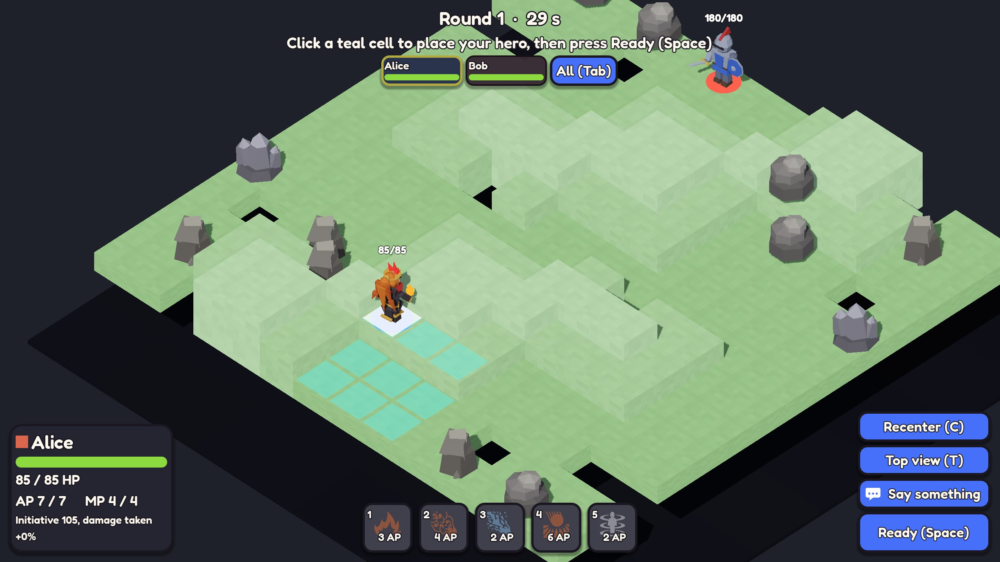

# Rune Ascent

A turn-based tactical game on a board you can turn: fight alone through a tower of floors with a party of three heroes, or meet friends in a **6 against 6** match. Isometric, low-poly, played with the mouse (or the keyboard alone), in English or French.

## Play it

**https://gha-kzr.github.io/rune-ascent/**: in the browser, nothing to install. Pick **Solo** for the tower, or **Multiplayer** to host a match (you get a room link to send) or join one with a room code.



## Screenshots

<table>
  <tr>
    <td width="50%"></td>
    <td width="50%"></td>
  </tr>
  <tr>
    <td><b>Solo fight</b>: your three heroes against a team of enemies, a spell being aimed (orange cells).</td>
    <td><b>The hub</b>: levels, runes, spells, then the tower or a stage.</td>
  </tr>
  <tr>
    <td width="50%"></td>
    <td width="50%"></td>
  </tr>
  <tr>
    <td><b>Multiplayer lobby</b>: pick one of nine classes, a team, the map and the rules.</td>
    <td><b>A multiplayer match</b>: everyone places a hero, then the fight begins.</td>
  </tr>
</table>

## Core features

**Tactics**
- Dofus / Disgaea-style turns: action points for spells, movement points for walking, initiative order shown at the top.
- A real battlefield: heights (a step climbs one level), obstacles and holes, line of sight, pushes, pulls, teleports and charges, damage types with resistances, statuses over time.
- Enemies fight as teams with roles (tank, bruiser, ranged, support, skirmisher) and an AI that positions itself.

**Solo**
- A **tower** of floors (the same for everyone: map and enemies come from the floor number), with elites, bosses and boons, and one-battle **stages** that unlock higher floors.
- Three heroes that level up, learn spells and carry **runes** that you find, fuse and salvage.
- A guided first fight, hints that explain the rest, achievements and runs that are saved between floors.

**Multiplayer** (PvP, up to 6 against 6)
- Nine classes with fixed kits, no levels or runes: a match is decided by play, not by progression.
- A room code or link, a lobby where the host picks the map shape, size and rules, and quick emotes in the fight.
- If a player drops out the AI plays their hero until they come back; if the host leaves another player takes over; a blinking connection reconnects by itself.
- Optional **card combat**: spells become a deck, you draw four cards and play two each turn.
- Lobby rules the host can change: map shape and size, turn time, card combat and **friendly fire** (solo has none).

**Around it**
- Hand-made models, no downloaded 3D art; sounds and music credited in [`CREDITS.md`](CREDITS.md).
- Keyboard-only menus, rebindable keys, three battle speeds, window and UI scale settings.
- Designers' tools: a balance lab, a spell stage and a model workshop (see below).

Every rule and control is in [`docs/gameplay.md`](docs/gameplay.md).

## How it is made

The game is a [Godot 4.7](https://godotengine.org) project (GDScript), written from the command line together with an AI agent ([Claude Code](https://claude.com/claude-code)); the editor is optional.

1. **Decide before coding.** Each feature starts as a short decision record in [`docs/decisions/`](docs/decisions/) and a plan in [`docs/plans/`](docs/plans/); the finished and proposed milestones are in [`docs/roadmap.md`](docs/roadmap.md), the ideas in [`docs/backlog.md`](docs/backlog.md).
2. **Content is data.** Spells, enemies, heroes, maps, runes and the tower are `.tres` files checked by tests, so balancing rarely means touching code. An editor plugin previews spells and enemies and runs AI-against-AI battles to find outliers.
3. **Rules apart from the screen.** The battle rules are plain scripts with no nodes and no clock (a seeded random generator), tested without a window. That is also what makes multiplayer possible: every player replays the same log of decisions and gets the same battle, with a small relay server that only passes messages ([how it works](docs/multiplayer.md)).
4. **Small steps, always tested.** Work happens on a milestone branch, task by task, with a headless test suite (about a thousand tests) run before every commit; the multiplayer relay and whole matches between real browser tabs have their own tests.
5. **Own art and sound.** Models are built by code recipes, not imported; the audio is credited per file.

### Run it yourself

```sh
godot                                              # the game
godot --headless --script res://tests/run_tests.gd # the tests
tools/export_web.sh                                # the web build, in build/web
```

Setup, every command, how to add content and the conventions for contributors (human or AI) are in [`CLAUDE.md`](CLAUDE.md).
